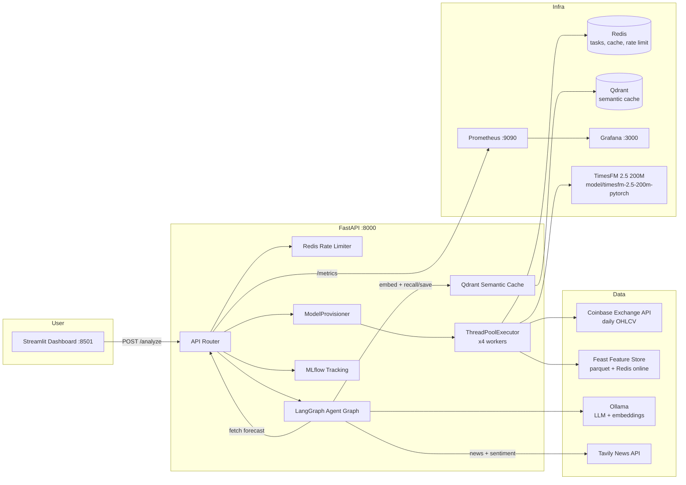

# Crypto Prism Ops

**Institutional-grade MLOps platform for cryptocurrency price forecasting and market intelligence.**

Crypto Prism Ops ingests daily OHLCV data for crypto pairs, produces multi-step price forecasts with a zero-shot TimesFM foundation model, and synthesizes them into human-readable market reports through a LangGraph multi-agent system — all wrapped in a full MLOps lifecycle: feature store, experiment tracking, caching, monitoring, drift detection, and Kubernetes-ready deployment.

The project was built and iterated on over ~7 months, migrating from a trained LSTM model to a zero-shot foundation-model architecture (with a measured accuracy win). The engineering decisions behind that evolution are documented in [Project Evolution](#project-evolution) and [Engineering Decisions & Tradeoffs](#engineering-decisions--tradeoffs).

---

## Table of Contents

- [Key Capabilities](#key-capabilities)
- [Screenshots](#screenshots)
- [Architecture](#architecture)
- [The Modeling Approach](#the-modeling-approach)
- [Project Evolution](#project-evolution)
- [Engineering Decisions & Tradeoffs](#engineering-decisions--tradeoffs)
- [LSTM vs TimesFM: The Head-to-Head Experiment](#lstm-vs-timesfm-the-head-to-head-experiment)
- [Repository Layout](#repository-layout)
- [Getting Started](#getting-started)
- [API Reference](#api-reference)
- [How a Request Flows End-to-End](#how-a-request-flows-end-to-end)
- [Observability](#observability)
- [Kubernetes Deployment](#kubernetes-deployment)
- [Configuration Reference](#configuration-reference)
- [Testing & Linting](#testing--linting)
- [Notes & Limitations](#notes--limitations)

---

## Key Capabilities

- **Zero-shot price forecasting with TimesFM 2.5 (200M)** — a single pre-trained foundation model serves every ticker; no weight training required. Per-ticker "provisioning" (fitting a scaler + validation) completes in seconds.
- **LangGraph multi-agent analysis** — a 4-node graph (`performance analyst → market expert → report generator → critic`) turns forecasts and live news into a Bloomberg-style report with an explicit market stance and confidence.
- **Semantic caching (Qdrant)** — repeated analysis requests short-circuit to cached reports (embedding similarity > 0.95, same-ticker, 24h TTL) instead of re-invoking the LLM.
- **Feature store (Feast)** — OHLCV + RSI + MACD written to an offline parquet store and materialized to an online Redis store for low-latency serving.
- **Async task queue (Redis)** — training/provisioning and prediction run off the event loop in a thread pool, with status persisted to Redis and exposed for polling.
- **Experiment tracking (MLflow)** — every provisioning run logs params, metrics, scaler artifacts, and plots.
- **Observability (Prometheus + Grafana)** — request metrics, prediction latency, training duration, cache hit rates, Redis/system gauges, and per-ticker drift scores.
- **Data drift monitoring** — a custom drift check (mean-shift + volatility ratio) writes JSON/HTML reports per ticker and updates Prometheus gauges.
- **Rate limiting** — Redis-backed sliding window (3 req / 60s per endpoint) protects the LLM and training backends.
- **Kubernetes-ready** — manifests for every service (`k8s/`), validated against minikube.

---

## Screenshots


---

## Architecture



| Component | Role |
|---|---|
| **FastAPI backend** (`Backend/`) | REST API, rate limiting, async task orchestration, health/metrics endpoints |
| **Streamlit frontend** (`frontend/`) | Dashboard for ticker analysis: report, recommendation, and forecast chart |
| **TimesFM 2.5 200M** (`model/`) | Pre-trained time-series foundation model; the only model used for forecasting |
| **LangGraph agents** (`src/agents/`) | 4-node multi-agent pipeline producing the final market report |
| **Qdrant** | Vector store for semantic caching of agent reports |
| **Redis** | Task status, prediction cache (24h), rate-limiting counters |
| **Feast** | Feature store: offline parquet + online store (Redis) |
| **MLflow** | Experiment/artifact tracking (file-backed) |
| **Prometheus / Grafana** | Metrics scraping and dashboards |
| **Ollama** | Local LLM (`gemma4:31b-cloud`) + embeddings (`nomic-embed-text`) |

---

## The Modeling Approach

The forecasting layer follows a **zero-shot foundation-model** philosophy rather than the classic "train a model per asset" pattern.

### TimesFM 2.5 200M (current, production)

- **One frozen foundation model serves every ticker.** TimesFM is a decoder-only foundation model pre-trained on ~100B real-world time-series points. No weights are trained or fine-tuned at any point in the running pipeline.
- **Channel-independent forecasting.** TimesFM is univariate, so `PrismModel` (`src/model/model_defination.py`) forecasts each feature channel (Open, High, Low, Close, Volume, RSI, MACD) independently and reassembles them into the multi-variate `(pred_len, num_features)` output the pipeline expects. `force_flip_invariance` is enabled; `infer_is_positive=False` so volatile crypto prices are not clamped.
- **"Training" is provisioning, not learning.** `train_parent()` / `train_child()` now: fetch OHLCV → fit a `StandardScaler` → load TimesFM → run a single-window validation pass → save the scaler. The scaler is deliberately the **"model exists" marker**; whether a forecast is available for a ticker is a filesystem fact, owned in one place.
- **Parent/child is a naming convention.** The legacy parent→child *transfer learning* distinction is gone. Parent (`BTC-USD`) and children (any other ticker) share the same foundation weights; the only per-ticker artifact is the fitted scaler. The parent-before-child dependency survives as an operational ordering rule (the reference ticker is provisioned first, and a child request auto-enqueues its parent).

### Legacy LSTM path (retired, kept for reference)

The earlier parent→child LSTM system is **not part of the running system**. It is retained in the repo and in `experiments/` purely as a benchmark baseline and a candidate for a future fine-tuning feature. Every code path that the running pipeline uses (provisioning, training, inference, provisioning seam) is TimesFM-based. The measured head-to-head in [LSTM vs TimesFM](#lstm-vs-timesfm-the-head-to-head-experiment) is why the switch was made.

---

## Project Evolution

The git history tells the story of an incremental, milestone-driven build-out:

| Phase | Commits | What landed |
|---|---|---|
| **Jan 2026 — Foundation** | `5414182` → `a22d86d` | Initial scaffold, logging, Feast feature-store integration (offline parquet + Redis online store), LSTM model definition and training pipeline |
| **Jan 2026 — Serving** | `28e3252` → `21a7bf9` | FastAPI backend with prediction/training endpoints, Streamlit frontend, Docker Compose + Docker build fixes |
| **Feb 2026 — Agentic + Ops layer** | `3b35079` → `4220044` | LangGraph multi-agent analysis, Qdrant semantic cache, data-drift checks, Redis rate limiting, Prometheus/Grafana observability, Kubernetes manifests, system-reset endpoint |
| **Aug 2026 — Model migration** | `840354b` → `865b752` | **Switched from LSTM to TimesFM 2.5 zero-shot pipeline**, added the `ModelProvisioner` seam, vendored the TimesFM 2.5 package for Docker, fixed Ollama empty-response handling and calendar-day forecast dates, ran the LSTM-vs-TimesFM experiment, and made provisioning fast (`evaluate_quick`). |

### The pivot to TimesFM (Aug 2026)

This was the defining architecture change:

1. **Experiment first.** A fair walk-forward comparison on ETH-USD (2025 test region, chronological split, scalers fit on train only) showed TimesFM beating the trained LSTM child — see the [results table](#lstm-vs-timesfm-the-head-to-head-experiment).
2. **Weight training removed entirely.** The `.pt` weights, `CryptoData`, and `fit_model` path became dead code. "Does a model exist?" was redefined to "does the per-ticker scaler exist?" and centralized in `src/model/provisioning.py`.
3. **Provisioning got fast.** The full-history backtest (≈12 min/ticker) was replaced by `evaluate_quick`, a single-window validation pass (≈45 s/ticker) — because the job is no longer weight training, just scaler fit + sanity validation.
4. **Ops bugs fixed along the way.** Task status now reads the live Redis client (not a stale module-load value), the `/analyze` flow propagates the real `task_id` through to frontend polling, the MLflow artifact path was made Linux-safe, and the vendored `timesfm` package (with the `huggingface_hub[cli]` dependency fix) unblocked the Docker build.

---

## Engineering Decisions & Tradeoffs

| Decision | Chosen | Alternatives considered | Why / tradeoff |
|---|---|---|---|
| **Model architecture** | TimesFM 2.5 zero-shot | Trained parent→child LSTM with transfer learning | TimesFM won the head-to-head (RMSE $177 vs $210, directional accuracy 76.3% vs 64.4%) *and* removed per-ticker training cost. Tradeoff: no asset-specific fine-tuning — the model can't adapt to a ticker's idiosyncrasies beyond what its 100B-point pretraining covers. Kept the LSTM path as a benchmark and future fine-tune option. |
| **"Model exists" definition** | Per-ticker `StandardScaler` file | `.pt` weight file, string-matching exceptions | With a frozen foundation model there is nothing to train; the scaler (and its validation run) is the only per-ticker artifact. Filesystem truth makes provisioning a single, testable decision in `ModelProvisioner` (see [ADR 0001](docs/adr/0001-model-provisioning-seam.md)). |
| **Provisioning seam** | One module, injected I/O | HTTP-layer checks scattered across endpoints | "Is a forecast available, and if not what do we train?" was previously answered three different ways (stale `.pt` check, exception-text match, ignored-arg `check_model_exists`). Centralized in `src/model/provisioning.py` so the HTTP layer and tests cross the same seam. |
| **Validation strategy** | `evaluate_quick` single-window | Full rolling-window backtest per provisioning run | Provisioning is seconds-work now; a 12-minute backtest per ticker was pure overhead. Kept the full backtest as `evaluate_model_temp` for ad-hoc analysis. |
| **Metrics scope** | OHLC only | All 7 features | Volume is orders of magnitude larger in raw units; including it makes MSE ~1e10 and RMSE/R2 meaningless. |
| **Forecast calendar** | Calendar days | Business days | Crypto trades 24/7/365; `pd.bdate_range` skipped weekends and produced wrong dates. |
| **Data source** | Coinbase Exchange API (paginated daily candles) | yfinance | Coinbase returns clean crypto candles with proper 24/7 daily boundaries and no delisted-asset surprises. Tradeoff: Coinbase-listed pairs only. yfinance remains used in the drift checker. |
| **Foundation package** | Vendored `timesfm/` (local install) | PyPI `timesfm` | PyPI shipped v1 (JAX-only); the pipeline needs `TimesFM_2p5_200M_torch`. Vendoring pinned the right version and fixed the `huggingface_hub[cli]` build issue. Tradeoff: must keep the vendored copy updated. |
| **Model weights in the image** | Gitignored, mounted at runtime | Baked into the Docker image | The ~925 MB `model.safetensors` is bind-mounted from the repo root (dev) or provided at deploy time (prod). Keeps images lean and build cache warm; compose already bind-mounts the repo for hot reload. |
| **Task execution** | `ThreadPoolExecutor` (4 workers) via `asyncio.run_in_executor` | Celery, RQ | Adequate for the workload, zero extra infrastructure. Tradeoff: no cross-host distribution, no retries/queues — acceptable for single-node orchestration; the async seam is preserved for future workers. |
| **LLM resilience** | Retry wrapper around Ollama invokes | Single-shot, SystemMessage-only prompts | Cloud-backed Ollama models sometimes emit a `done_reason='load'` frame (no content), yielding empty reports. Retrying absorbs the transient load race. |
| **Semantic cache threshold** | Cosine similarity > 0.95 + same-ticker filter + 24h TTL | Recency-only cache, no vector cache | Reuses LLM output for near-duplicate queries without risking stale cross-ticker results. Tradeoff: strict threshold limits hit rate; tuned conservatively for correctness. |
| **Experiment tracking backend** | `file://` MLflow store | DAGsHub/remote server | Zero-setup local tracking; artifact paths fixed to be Linux-safe in the container. Tradeoff: not shareable across machines — fine for single-node operation. |

---

## LSTM vs TimesFM: The Head-to-Head Experiment

Run in `experiments/compare_lstm_vs_timesfm.py` — a fair protocol:

- One shared dataset per ticker (daily OHLCV + RSI + MACD, Coinbase).
- Chronological split with no future leakage; scaler fit on **train only**:
  - TRAIN targets `2020-01-01 → 2023-12-31`, VAL `2024-01-01 → 2024-12-31`, TEST `2025-01-01 → 2026-08-14`.
- LSTM parent trained on BTC-USD, weights transferred to ETH-USD child and fine-tuned on ETH train (both `fine_tune` and `freeze` variants).
- TimesFM: zero-shot, no training.
- Walk-forward evaluation on the ETH-USD test region (step = `pred_len` = 5, context = 512), metrics in raw price space.

**Results (ETH-USD test region, close channel):**

| Model | RMSE ($) | MAE ($) | R² | Directional accuracy (1-day move) |
|---|---|---|---|---|
| **TimesFM 2.5 (zero-shot, production)** | **177.38** | **123.30** | **0.9570** | **76.3%** |
| LSTM child (transfer: fine-tune) | 210.00 | 157.55 | 0.9398 | 64.4% |
| LSTM child (transfer: freeze) | 229.03 | 166.02 | 0.9284 | — |

TimesFM wins on every error metric and on directional accuracy — without any training. This is the empirical basis for the migration. Raw data and forecasts are saved under `outputs/experiment/` (run `python experiments/plot_comparison.py` to reproduce the chart and accuracy numbers).

---

## Repository Layout

```
crypto-prism-ops/
├── Backend/                 # FastAPI app, task queue, rate limiter, schemas, Dockerfile
├── frontend/                # Streamlit dashboard
├── src/
│   ├── agents/              # LangGraph graph, nodes, tools, Qdrant semantic cache
│   ├── config/              # Central Config dataclass
│   ├── data/                # Coinbase ingestion, feature engineering, RSI/MACD
│   ├── model/               # PrismModel (TimesFM wrapper), evaluation, ModelProvisioner
│   ├── monitoring/          # Drift detection
│   └── pipeline/            # Training (provisioning) + inference pipelines
├── feature_store/           # Feast definitions (parquet offline + Redis online)
├── experiments/             # LSTM-vs-TimesFM benchmark + plotting
├── model/                   # TimesFM 2.5 200M weights (gitignored, ~925 MB)
├── timesfm/                 # Vendored TimesFM 2.5 Python package (Docker build)
├── k8s/                     # Kubernetes manifests
├── grafana/                 # Grafana provisioning (datasource)
├── prometheus.yml           # Scrape config
├── docker-compose.yml       # Full local stack
├── docs/                    # approach.md, implementation.md, ADR 0001
└── outputs/                 # Scaler artifacts, metrics, drift reports (gitignored)
```

---

## Getting Started

### Prerequisites

- **Docker** with Docker Compose (v2).
- **Ollama** running on the host (LLM + embeddings).
- ~2 GB free disk for the TimesFM weights.
- A **Tavily API key** (free tier is fine) for live crypto news — optional; news node degrades gracefully without it.

### 1. Start Ollama and pull the models

Crypto Prism Ops needs two Ollama models:

```bash
ollama serve
```

In a second terminal:

```bash
# Embeddings for the Qdrant semantic cache
ollama pull nomic-embed-text

# The analysis LLM (used by the LangGraph agents)
ollama pull gemma4:31b-cloud
```

> The LLM is configurable via `OLLAMA_MODEL` (default `gemma4:31b-cloud`). `gpt-oss:20b-cloud` is a supported alternative. If Ollama is unreachable, the backend falls back to a `MockLLM` so the rest of the stack still runs.

### 2. Configure the environment

```bash
cp .env.example .env
# then add your Tavily API key:
#   TAVILY_API_KEY=tvly-...
```

### 3. Download the TimesFM weights

The weights (~925 MB) are gitignored and **must be downloaded once** before the backend can forecast:

```bash
python src/download_times_model.py
```

This resolves `google/timesfm-2.5-200m-pytorch` from Hugging Face into `model/timesfm-2.5-200m-pytorch/`.

### 4. Run the stack with Docker

```bash
docker-compose up -d --build
```

This builds and starts: FastAPI backend, Streamlit frontend, Redis, Qdrant, Prometheus, and Grafana. First build pulls the heavy torch/feast layers, so allow a few minutes.

Check everything is healthy:

```bash
docker-compose ps
curl http://localhost:8000/health        # {"status":"healthy"}
```

### Service URLs

| Service | URL |
|---|---|
| Backend API + Swagger docs | http://localhost:8000 · http://localhost:8000/docs |
| Frontend (Streamlit) | http://localhost:8501 |
| Redis Insights | http://localhost:8001 |
| Qdrant | http://localhost:6333 |
| Prometheus | http://localhost:9090 |
| Grafana | http://localhost:3000 (`admin`/`admin`) |
| MLflow | http://localhost:5000 (if port-mapped) |

### First run: provision a ticker

The first request to `/analyze` (or `/predict-child`) auto-triggers provisioning for the parent (`BTC-USD`) then the requested child. The frontend handles this: it polls `/status/{task_id}` until the scalers exist, then renders the analysis. In Docker, the first provisioning also downloads market history, so give it a moment.

### Manual / local development (no Docker)

```bash
pip install uv
uv venv .venv && uv pip install -r Backend/requirements.txt

# Backend (from repo root; PYTHONPATH must include the root)
PYTHONPATH=. uvicorn Backend.main:app --host 0.0.0.0 --port 8000 --reload

# Frontend
streamlit run frontend/app.py
```

Redis, Qdrant, and Ollama must be reachable for full functionality (compose provides Redis/Qdrant; Ollama is host-local).

---

## API Reference

| Method | Endpoint | Description |
|---|---|---|
| `GET` | `/health` | Liveness probe |
| `POST` | `/train-parent` | Provision parent (`BTC-USD`). Rate-limited 3/60s |
| `POST` | `/train-child` | Provision a child ticker (`{"ticker": "ETH-USD"}`) |
| `POST` | `/predict-parent` | Forecast for the parent ticker |
| `POST` | `/predict-child` | Forecast for a child ticker (`{"ticker": "ETH-USD"}`); returns **202** + `task_id` if not yet provisioned (auto-provisions) |
| `POST` | `/analyze` | Full LangGraph analysis (`{"ticker": "ETH-USD", "thread_id": "..."}`), with semantic-cache shortcut |
| `GET` | `/status/{task_id}` | Poll training/provisioning status (`parent_training` or `train_child_{TICKER}`) |
| `GET` | `/system/logs` | Tail backend logs |
| `POST` | `/system/reset` | Flush Redis DB and recreate the Qdrant cache collection |
| `POST` | `/monitor/parent` · `/monitor/{ticker}` | Trigger drift checks |
| `GET` | `/monitor/{ticker}/drift` | Latest drift report JSON for a ticker |
| `GET` | `/metrics` | Prometheus scrape endpoint |

**Prediction response shape** (`/predict-child`): a `predictions` object with `next_day`, `next_week` (min/max), `full_forecast` (5 calendar-day OHLC points), plus a 30-day `history` window used for charting.

**Training auto-chaining:** requesting a child when the parent is missing enqueues the parent *and* chains the child to start when the parent completes — the client polls a single `task_id`.

---

## How a Request Flows End-to-End

1. **User** clicks "Generate Analysis" in the Streamlit UI → `POST /analyze` with a ticker.
2. **Agent graph** (`analyze_stock`) first checks the **Qdrant semantic cache**: embed the query (`nomic-embed-text`), search `dataset_cache`, return the cached report if similarity > 0.95 for the same ticker within 24h.
3. **On cache miss**, the agent calls the internal predict endpoint, which invokes `ModelProvisioner`:
   - If the ticker's scaler exists → predict immediately.
   - If missing → enqueue provisioning (parent first, then child via chained task) and return HTTP 202 with `task_id`.
4. **Provisioning worker** (thread pool): fetch OHLCV from Coinbase → compute RSI/MACD → write to the Feast offline store and materialize to Redis online → fit scaler → single-window TimesFM validation → save scaler + log run to MLflow.
5. **Forecast** is produced by `PrismModel` (channel-independent TimesFM), cached in Redis for 24h, and merged with 30-day history.
6. **Agent nodes** run sequentially (`performance → market expert → report generator → critic`), pulling live news from Tavily, and produce the final report with stance/confidence.
7. The result is saved back to Qdrant for future cache hits and rendered in the dashboard.

---

## Observability

- **Prometheus** scrapes `/metrics` on the backend (15s interval). Instrumentation covers request latency/status via `prometheus-fastapi-instrumentator`, plus custom gauges/counters/histograms defined in `Backend/state.py`: system CPU/RAM/disk, Redis up/keys, training status/duration/MSE, prediction count/latency, Redis cache hit/miss, and per-ticker drift score/volatility index.
- **Grafana** auto-provisions the Prometheus datasource (`grafana/provisioning/`) — log in at `:3000` and build dashboards on the `fastapi` job.
- **Drift monitoring** (`src/monitoring/drift_check.py`): compares the last 30 days of market data against the prior 150 days, computes a per-feature mean-shift score and a volatility ratio, and classifies the ticker as `Healthy` / `Degraded` / `Critical`. Reports (JSON + HTML) land in `outputs/{ticker}/drift/` and are exposed via the API.

---

## Kubernetes Deployment

Manifests for every service live in `k8s/` (deployments, services, config-map, secrets, monitoring). They target minikube and were validated during development:

```bash
minikube start
kubectl apply -f k8s/
```

Note that the TimesFM weights and feature-store data are **not** in the image; provide them via a persistent volume or config in a real deployment.

---

## Configuration Reference

### Environment variables

| Variable | Default | Purpose |
|---|---|---|
| `TAVILY_API_KEY` | — | News search API key (agent market-expert node) |
| `OLLAMA_BASE_URL` | `http://host.docker.internal:11434` | Ollama endpoint |
| `OLLAMA_MODEL` | `gemma4:31b-cloud` | LLM used by the agent nodes |
| `REDIS_HOST` / `REDIS_PORT` | `redis` / `6379` | Redis connection |
| `QDRANT_HOST` / `QDRANT_PORT` | `qdrant` / `6333` | Qdrant connection |
| `MLFLOW_TRACKING_URI` | `file:///app/mlruns` | MLflow backend |
| `API_BASE_URL` | `http://localhost:8000` | Agent-internal predict endpoint |
| `API_URL` | `http://localhost:8000` | Frontend → backend URL (compose: `http://fastapi:8000`) |

> On Linux Docker hosts, `host.docker.internal` may need `extra_hosts: ["host.docker.internal:host-gateway"]` in compose to reach host Ollama.

### Pipeline config (`src/config/pipeline_config.py`)

| Field | Default | Meaning |
|---|---|---|
| `parent_ticker` | `BTC-USD` | Reference/parent ticker |
| `start` / `child_start` | `2020-01-01` / `2022-01-01` | History fetch start |
| `context_len` / `pred_len` | `512` / `5` | Forecast context / steps (TimesFM supports up to 16384 context) |
| `features` | Open, High, Low, Close, Volume, RSI, MACD | Channels forecasted |
| `timesfm_model_path` | `model/timesfm-2.5-200m-pytorch` | Local weights |
| `parent_epochs`, `child_epochs`, `transfer_strategy`, `fine_tune_lr` | — | **Dead fields** from the LSTM era; unused by the TimesFM pipeline |

---

## Testing & Linting

```bash
ruff check .            # linting
pytest tests/           # tests (test suite is a work-in-progress)
```

The `ModelProvisioner` seam (ADR 0001) was designed specifically so the parent-then-child decision logic can be tested without touching Redis, the filesystem, or the model.

---

## Notes & Limitations

- **Not investment advice.** Forecasts and reports are generated for analysis; markets are unpredictable.
- **TimesFM is zero-shot** — no per-ticker fine-tuning. The retired LSTM path and `experiments/` benchmark are the roadmap for reintroducing trained models.
- **Single-node by design** — the task executor is an in-process thread pool; cross-host distribution would require swapping the task seam (e.g., Celery/RQ).
- **Coinbase-only data** — tickers must be Coinbase-listed pairs (`BTC-USD`, `ETH-USD`, `SOL-USD`, …).
- The `docs/` folder contains the original agile development plan (`approach.md`), the crypto-adaptation spec (`implementation.md`), and architecture decision records (`docs/adr/`).